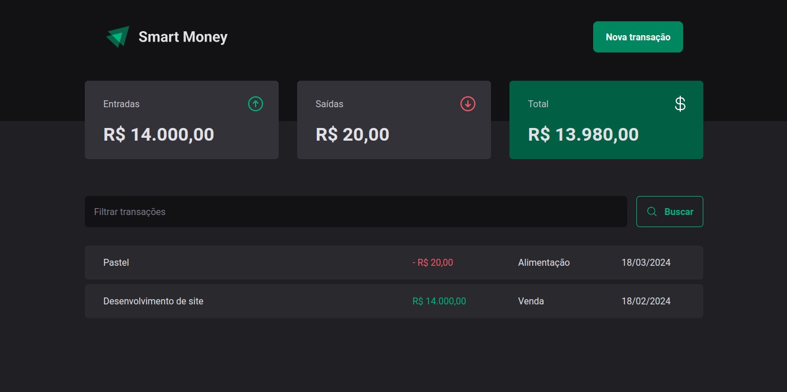

# Smart Money 📱

> Status: Developed ✅

### Initial page:

### Add new item:

### After registering item:


Smart Money is a project created to solve a real problem I currently have. I've always preferred minimalist interfaces, with as little information as possible, and combining the difficulty of finding something similar, with my knowledge, I decided to create my own financial management platform. Features:
- Initial page
- Modal to add inputs and outputs.
- During development, I chose to use JSON SERVER as the project API, due to its ease of configuration and application


## Technologies used in this project 🛠️

- [VITE](https://vitejs.dev/)
- [Styled Components](https://styled-components.com/)
- [ReactJS](https://legacy.reactjs.org/docs/getting-started.html)
- [React Hook Form](https://react-hook-form.com/)
- [Phosphor Icons](https://phosphoricons.com/)
- [Radix UI](https://www.radix-ui.com/)
- [Axios](https://axios-http.com/docs/intro)
- [Zod](https://zod.dev/)

## Contribute to the development of the project 💻

1. #### Fork this repository, using the button that appears in the top right corner `fork`.
2. #### After that, clone the repository

```bash
$ git clone git@github.com:holices/smart-money.git
```

3. #### To run the Front-end


Open the cloned repository and install the required dependencies, using the IDE terminal:
```bash
$ npm install
```

#### Start running the back-end, using:
```bash
$ npm run dev:server
```

#### Now, to start front-end, run:
```bash
$ npm run dev
```

4. Edit the code in the way you think will be best for the project, adding features, solving problems you find.

5. Make a `pull request` to the repository of the project in question and describe exactly what has changed and any action needed to test or run it.

## Disclaimer and Copyright ©️
Application developed through similar projects in the Ignite module of the @Rocketseat educational platform.

### Thank you in advance for any contribution!
